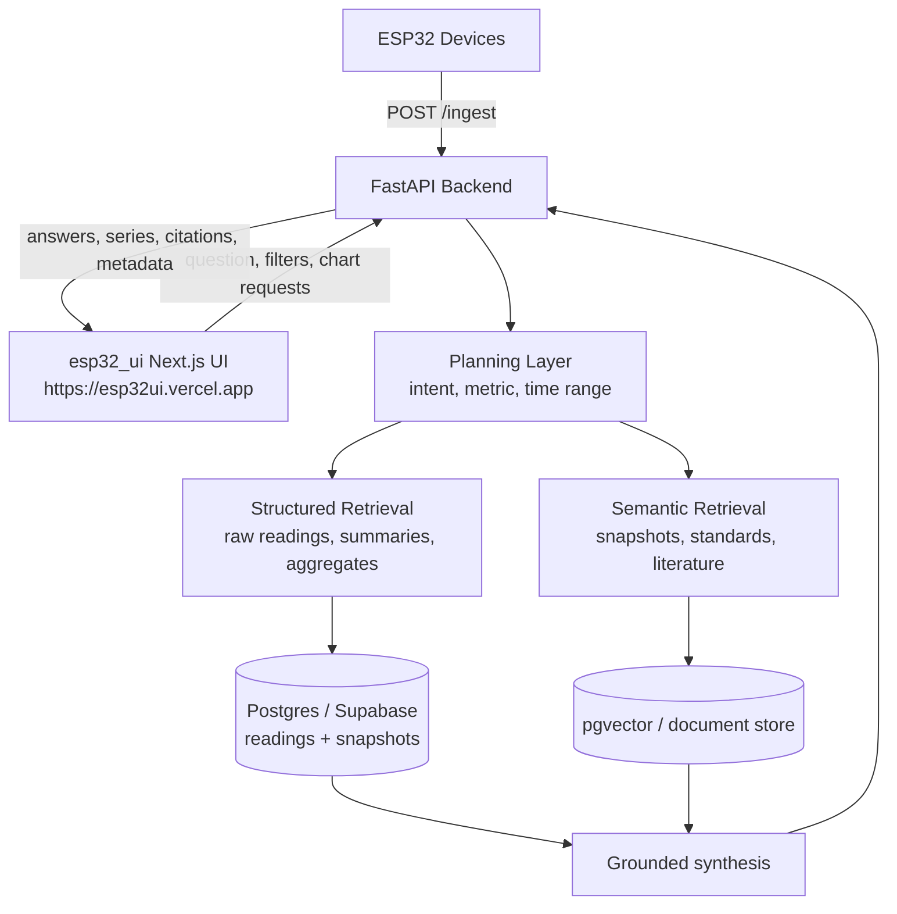

# Architecture

## Overview

`esp32_api` is the backend half of a two-repo system:

* `esp32_api` handles ingestion, planning, retrieval, indexing, and API orchestration.
* `esp32_ui` handles UI execution, including dashboards, charts, filters, and user interaction.

The backend is best described using a canonical AI application workflow:

1. Planning
2. Retrieval
3. UI Execution

This framing is useful both technically and in interviews because it translates well across Python, TypeScript, and .NET stacks.

## System Diagram

## Repo Mapping

### Planning

Planning is the step that turns a user question into a concrete execution path.

Responsibilities:

* interpret intent
* infer metric
* resolve time range
* choose structured retrieval, semantic retrieval, or hybrid retrieval

Primary file:

* [`server/app/rag/rag_query.py`](/workspaces/esp32_api/server/app/rag/rag_query.py)

Programming style:

* Mostly functional mode
* Parsing, prompt construction, time resolution, and response shaping are easiest to reason about as pure transformations

### Retrieval

Retrieval is the step that grounds the answer in actual data sources.

Structured retrieval responsibilities:

* raw readings
* summaries
* bucketed aggregates
* archived snapshots

Semantic retrieval responsibilities:

* vector indexing of snapshots
* literature/document ingestion
* retrieval over standards and reference materials

Primary files:

* [`server/app/db/supabase_queries.py`](/workspaces/esp32_api/server/app/db/supabase_queries.py)
* [`server/app/rag/rag_snapshots.py`](/workspaces/esp32_api/server/app/rag/rag_snapshots.py)
* [`server/app/rag/rag_index.py`](/workspaces/esp32_api/server/app/rag/rag_index.py)
* [`server/app/rag/ingest_docs.py`](/workspaces/esp32_api/server/app/rag/ingest_docs.py)

Programming style:

* Mixed mode
* Functional for transforms and chunking
* Object-oriented/composition mode for vector stores, query engines, and provider clients

### UI Execution

UI execution is where the user sees results and decides what to do next.

Responsibilities:

* display time-series and aggregates
* present grounded answers and citations
* expose filters and follow-up questions
* support human review rather than blind automation

Primary UI target:

* `esp32_ui` at `https://esp32ui.vercel.app`

Note:

* The `ui/` directory in this repo is a placeholder scaffold from `create-next-app`; it is not the real application shell.

## Why the Backend Looks This Way

The structure changed as frontend requirements became clearer.

Key drivers:

* performance: bucketed aggregation and summary endpoints were added to reduce frontend over-fetching and expensive client-side computation
* separation of concerns: database and query helpers moved out of `main.py`
* UI-driven API design: endpoints evolved to support charts, filters, and question-answering workflows rather than a simple ingest-only service

## Cross-Stack Translation

This architecture maps cleanly onto enterprise .NET / Blazor environments.

Examples:

* FastAPI `Depends(...)` maps conceptually to ASP.NET Core dependency injection.
* FastAPI middleware maps to the ASP.NET middleware pipeline.
* Pydantic request/response models map to C# DTOs or records.
* Python `async`/`await` maps to C# `async`/`await` with `Task`.
* The Python service can act as an AI sidecar behind a .NET UI or workflow shell.

That means the same Planning -> Retrieval -> UI Execution model can be preserved even if the front-end shell is Blazor instead of React.

## Framework Responsibilities

Current backend code includes both LangChain and LlamaIndex.

Current rough division:

* LangChain:
  vector store and retriever plumbing
* LlamaIndex:
  higher-level query engines for SQL + retrieval workflows

Target direction:

* make Planning a clearer service boundary
* make Retrieval a clearer service boundary
* keep provider-specific model access behind a separate provider layer

## Enterprise Positioning

This architecture is suited to a common enterprise pattern:

* keep the system of record in existing applications and databases
* add a Python AI service for planning, retrieval, summarization, and anomaly interpretation
* expose grounded answers and human-reviewable outputs in a separate UI shell

That same pattern works for React/Next.js frontends, .NET/Blazor frontends, or hybrid environments.
